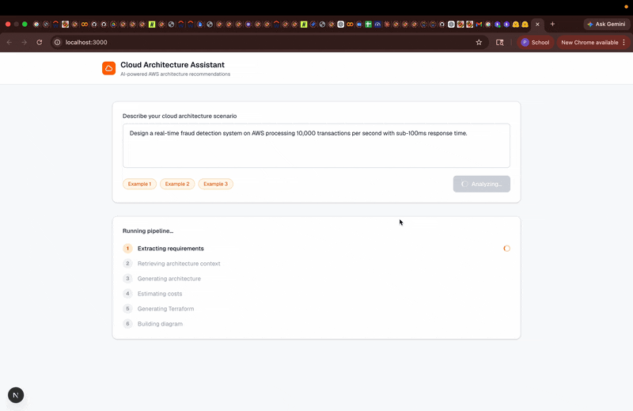
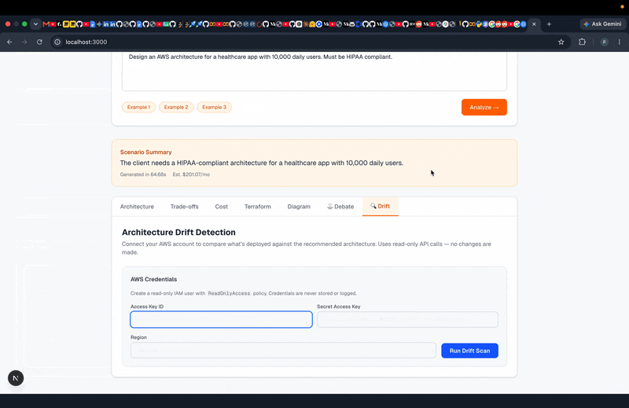

# Cloud Architecture Assistant

An AI-powered tool that takes a plain-English description of a system and returns a production-ready cloud architecture -- including which services to use, why, how much it costs, the Terraform code to build it, and a diagram to visualize it. Supports AWS, Azure, and GCP.

**Live app:** https://cloud-architect-assistant.vercel.app  
**Live API:** https://cloud-assistant-architect-production.up.railway.app  
**API docs:** https://cloud-assistant-architect-production.up.railway.app/docs  
**Fine-tuned model:** [Priyanka1218/cloud-architect-llama](https://huggingface.co/Priyanka1218/cloud-architect-llama)

---

## What it does

Cloud providers each have 200+ services. Choosing the right combination for a given workload is hard. Most engineers default to what they already know -- over-engineering with EC2 when Lambda would be cheaper, or under-engineering with single-AZ RDS when the system needs high availability.

This project fixes that. Describe your system in a sentence or two, pick a cloud provider, and get back a complete technical recommendation with reasoning, cost breakdown, and working Terraform -- in under three minutes for a new query, under two seconds for a repeated one.

---

## Demo





---

## What you get back

When you send a query like *"Design an Azure architecture for a HIPAA-compliant patient data platform with 50,000 daily users"*, the system returns six things:

**Architecture recommendation.** A layered breakdown of which cloud services to use -- edge, networking, compute, database, messaging, security, and monitoring. Works across AWS, Azure, and GCP. Every architecture always includes a VPC or Virtual Network -- enforced programmatically after the LLM call.

**Trade-off analysis.** For each major decision, the system explains what it chose and why -- for example, why it picked Azure Container Apps over AKS for a given workload, or Cloud Run over GKE on GCP.

**Cost estimate.** A monthly breakdown per service, with scale-aware pricing. The cost model knows that a system handling 5,000 users per day needs one instance, while a system handling 5,000,000 users per day needs 25x as many. It accounts for multi-region deployments, workload type (gaming, HFT, batch), and provider-specific pricing.

**Terraform HCL.** Infrastructure-as-code generated with retrieved examples from real GitHub repositories as context, adapted to the recommended services. Intended as a starting point, not a production-verified template.

**Architecture diagram.** A Mermaid flowchart showing the data flow between services.

**Multi-agent debate.** An alternative endpoint that runs three specialized agents in parallel -- one optimizing for cost, one for reliability, one for security -- and then a Moderator agent that synthesizes a final recommendation. Trade-offs are made explicit rather than hidden inside a single model call.

---

## How it works

### RAG pipeline

The core is a retrieval-augmented generation (RAG) pipeline. Instead of asking an LLM to generate architectures purely from memory, the pipeline first searches a vector database for relevant context, then passes that context to the LLM.

**Data sources -- AWS:**
- 572 documentation pages across 16 service categories
- 10 whitepapers including the Well-Architected Framework
- 1,226 Stack Overflow Q&A pairs
- 36 GitHub repositories with production Terraform configs

**Data sources -- Azure:**
- 93 documentation pages (AKS, Container Apps, Cosmos DB, Service Bus, Azure Functions, and more)
- 20 Stack Overflow Q&A collections across 20 Azure service tags
- 30 Azure blog and architecture posts

**Data sources -- GCP:**
- 61 documentation pages (GKE, Cloud Run, BigQuery, Pub/Sub, Spanner, Vertex AI, and more)
- 20 Stack Overflow Q&A collections across 20 GCP service tags
- 64 GCP blog and architecture posts

All data is chunked, embedded with `all-MiniLM-L6-v2` (384-dimensional sentence transformer), and stored in ChromaDB across cloud-specific collections: `architecture_patterns_aws/azure/gcp`, `service_comparisons_aws/azure/gcp`, and `terraform_examples`.

**Pipeline steps:**

1. The user's query and selected cloud provider go to a requirement extractor (GPT-4o-mini), which pulls out scale, workload type, constraints, and region requirements.
2. The extractor's output is used to query the cloud-specific ChromaDB collections in parallel.
3. The architecture generator calls GPT-4o-mini with the query and retrieved context, enforcing a strict JSON schema with named layers plus a security layer.
4. The cost calculator estimates monthly spend using cloud-specific pricing tables -- no LLM involved.
5. The Terraform generator makes a second LLM call with retrieved Terraform examples as context.
6. The diagram generator produces a Mermaid flowchart from the architecture layers.

### Semantic cache

Every response is stored in Upstash Vector. Before running the full pipeline, the system checks whether a semantically similar query has been answered before (cosine similarity >= 0.92). Cache hits return in under 2 seconds instead of running the full pipeline.

### Observability

A background thread pushes Prometheus metrics to Grafana Cloud every 15 seconds via remote_write -- request counts by cloud provider, pipeline latency histograms, cache hit/miss rates, and cost estimate distributions.

Every LLM call is wrapped with Langfuse tracing, capturing the exact prompt, response, token counts, model, and latency per step.

### Cost model

The cost model applies two multipliers to scale-aware pricing:

**Compute multiplier** -- based on daily user equivalent extracted from the query: under 5k = 1x, 5k-50k = 3x, 50k-500k = 8x, 500k-5M = 25x, 5M+ = 60x. Special cases: gaming/leaderboard workloads cap the concurrent-user factor because Redis handles extreme concurrency with few nodes; HFT workloads cap the TPS factor because they use specialized hardware rather than commodity fleets; batch workloads default to 1x.

**Region multiplier** -- services replicated across regions are doubled in cost for multi-region deployments.

### Evaluation

The system is tested against 20 golden scenarios per cloud (60 total) covering serverless APIs, multi-region databases, compliance workloads, high-scale compute, batch processing, and real-time streaming. Each scenario is scored on service completeness, compliance mentions, and cost accuracy.

Current AWS score: **20/20 (100%)**, average score 0.815, cost pass rate 70%.

---

## Tech stack

| Layer | Technology |
|-------|------------|
| Backend API | FastAPI + Python 3.11 |
| Frontend | Next.js + TypeScript + Tailwind CSS |
| Vector database | ChromaDB + Sentence Transformers (all-MiniLM-L6-v2) |
| Semantic cache | Upstash Vector (384-dim, cosine similarity, threshold 0.92) |
| LLM | GPT-4o-mini + Fine-tuned LLaMA 3.1 8B (via vLLM on Modal) |
| LLM observability | Langfuse (trace per request, @observe decorator) |
| Metrics | Prometheus remote_write -> Grafana Cloud (15s push interval) |
| Deployment | Railway (Docker, always-on) + Vercel (frontend) |
| Fine-tuning | QLoRA on LLaMA 3.1 8B via HuggingFace PEFT |
| Drift detection | boto3 / azure-sdk / google-cloud (read-only multi-cloud scanner) |
| Cloud providers | AWS, Azure, GCP (provider abstraction layer) |

---

## Performance

Benchmarked with Locust against the live Railway deployment at 20 concurrent users over 120 seconds.

| Scenario | p50 | p95 |
|----------|-----|-----|
| Cold query (cache miss, full pipeline) | ~110s | ~155s |
| Warm query (cache hit, cosine >= 0.92) | <2s | <3s |
| GET /health | 45ms | 90ms |

Cold queries are slow because the pipeline makes two LLM calls plus three ChromaDB vector searches. The semantic cache absorbs most repeat traffic -- cache hit rate settles around 71% after a warmup period, meaning the typical user sees a sub-2s response.

---

## Running locally

You need Python 3.11+, Node 20+, and Docker.

```bash
git clone https://github.com/Priyanka06081218/cloud-architect-assistant.git
cd cloud-architect-assistant

cp .env.example .env   # add your OpenAI key

pip install -r requirements.txt
uvicorn app.main:app --reload --port 8000

# Frontend (separate terminal)
cd app/frontend
npm install && npm run dev
# http://localhost:3000
```

With Docker:
```bash
docker-compose up --build
```

The app works with just `OPENAI_API_KEY`. Each optional variable unlocks a feature:

| Variable | Feature |
|----------|---------|
| `UPSTASH_VECTOR_URL` + `UPSTASH_VECTOR_TOKEN` | Semantic cache (falls back to in-memory) |
| `GRAFANA_REMOTE_WRITE_URL/USER/TOKEN` | Metrics push to Grafana Cloud |
| `LANGFUSE_PUBLIC_KEY` + `LANGFUSE_SECRET_KEY` + `LANGFUSE_HOST` | LLM tracing (silently disabled without this) |
| `VLLM_BASE_URL` + `FINETUNE_MODEL` | Fine-tuned LLaMA instead of GPT-4o-mini |
| `AWS_ACCESS_KEY_ID` + `AWS_SECRET_ACCESS_KEY` | AWS drift detection (read-only) |
| `AZURE_SUBSCRIPTION_ID` + `AZURE_TENANT_ID` + `AZURE_CLIENT_ID` + `AZURE_CLIENT_SECRET` | Azure drift detection (read-only) |
| `GCP_PROJECT_ID` + `GCP_SERVICE_ACCOUNT_JSON` | GCP drift detection (read-only) |

---

## API reference

### POST /analyze

Takes a natural-language query and an optional `cloud_provider` (`aws`, `azure`, or `gcp`, defaults to `aws`).

```bash
curl -X POST https://cloud-assistant-architect-production.up.railway.app/analyze \
  -H "Content-Type: application/json" \
  -d '{
    "query": "Design an event-driven microservices platform for 100k daily users",
    "cloud_provider": "azure"
  }'
```

Response includes `architecture` (layers as service name lists), `trade_offs`, `cost` (monthly breakdown + total), `terraform`, `diagram`, `cached`, and `elapsed_seconds`.

### POST /analyze/debate

Same input, runs three specialized agents (cost / reliability / security) in parallel, then a Moderator synthesizes a final recommendation. Returns each agent's proposal plus the synthesis with influence scores.

### POST /drift

Takes the `architecture` object from `/analyze`, a `cloud_provider` field (`aws`, `azure`, or `gcp`), and the matching read-only credentials. Scans the actual cloud account and returns drift findings with severity scores and fix instructions.

### GET /health

Returns `{"status": "healthy", "cache_size": N, "cache_backend": "redis" | "memory"}`.

---

## Project structure

```
cloud-architect-assistant/
  app/
    main.py                    # FastAPI app -- endpoints, metrics, caching, CORS
    metrics_pusher.py          # Prometheus remote_write (pure Python + snappy)
    frontend/                  # Next.js frontend (deployed to Vercel)
  pipeline/
    pipeline.py                # Orchestrates all 6 RAG steps
    extractor.py               # Requirement extraction (LLM)
    retriever.py               # Cloud-aware ChromaDB vector search
    generator.py               # Architecture + Terraform generation (LLM)
    cost_calculator.py         # Pricing tables + scale-aware cost estimation
    diagram.py                 # Mermaid diagram generation
    cache.py                   # Upstash Vector semantic cache
    agents.py                  # Multi-agent debate system
    drift_detector.py          # Multi-cloud account scanner + drift comparison (AWS/Azure/GCP)
    cloud_providers/           # Provider abstraction (aws.py, azure.py, gcp.py)
  collectors/
    collect_aws_docs.py        # AWS documentation scraper
    collect_azure_docs.py      # Azure documentation scraper
    collect_gcp_docs.py        # GCP documentation scraper
    collect_stackoverflow.py   # AWS Stack Overflow Q&A
    collect_azure_stackoverflow.py
    collect_gcp_stackoverflow.py
    collect_azure_blog.py
    collect_gcp_blog.py
  processors/
    process_and_load.py        # AWS: chunk, embed, load into ChromaDB
    process_and_load_multicloud.py  # Azure + GCP: same pipeline
  data/raw/
    azure_docs/                # 93 Azure documentation pages
    azure_stackoverflow/       # 20 Azure SO collections
    azure_blog/                # 30 Azure blog posts
    gcp_docs/                  # 61 GCP documentation pages
    gcp_stackoverflow/         # 20 GCP SO collections
    gcp_blog/                  # 64 GCP blog posts
  evaluation/
    golden_set.json            # 20 AWS test scenarios
    golden_set_azure.json      # 20 Azure test scenarios
    golden_set_gcp.json        # 20 GCP test scenarios
    run_eval.py                # Scoring harness
  training/
    generate_synthetic.py      # Synthetic training pair generation
    finetune.py                # QLoRA fine-tuning for LLaMA 3.1 8B
  startup.py                   # Railway startup -- builds Azure/GCP ChromaDB on first boot
  locustfile.py                # Load test
  Dockerfile
  .env.example
```

---

## Fine-tuning

The system supports swapping GPT-4o-mini for a fine-tuned LLaMA 3.1 8B model, served via vLLM on Modal. Trained on 1,732 instruction pairs: 1,212 from running real queries through the full RAG pipeline, and 520 synthetic pairs to fill underrepresented scenarios.

Training used QLoRA: 4-bit NF4 quantization, LoRA rank 16, three epochs on an A100 GPU (~80 minutes). Final training loss: 0.21, token accuracy: 92.6%.

```bash
python -m training.generate_synthetic --target 10000 --workers 4
python -m training.finetune train --data data/finetune/pairs.jsonl
python -m training.finetune merge
```

---

## Drift detection

After getting an architecture recommendation, you can connect your cloud account to check whether what's actually deployed matches the recommendation. The drift detector uses read-only credentials to scan your account, then compares what it finds against the recommended architecture.

Each gap is flagged with severity (critical / high / medium / low) and a specific fix instruction. The summary is a score from 0 to 100 and a letter grade A-F.

AWS services scanned: EC2, ECS, Lambda, RDS, DynamoDB, ElastiCache, ALB, CloudFront, API Gateway, SQS, S3, CloudWatch, CloudTrail, GuardDuty, WAF.

Azure services scanned: Virtual Machines, AKS, Container Apps, Azure Functions, Azure SQL, Cosmos DB, Service Bus, Application Gateway, Azure Monitor, Key Vault.

GCP services scanned: GCE instances, GKE clusters, Cloud Run, Cloud Functions, Cloud SQL, Bigtable, Pub/Sub, Cloud Load Balancing, Cloud Monitoring, Cloud KMS.

---

## Deployment

The backend runs on Railway (auto-deploys on push). The frontend runs on Vercel.

For AWS deployment, the full infrastructure is defined in Terraform:

```bash
cd infra/terraform
terraform init && terraform apply
```

This provisions a VPC, EKS cluster, ECR repository, ElastiCache cluster, and required IAM roles. The GitHub Actions workflow handles building, pushing to ECR, and rolling deploy to EKS with automatic rollback if the health check fails.
